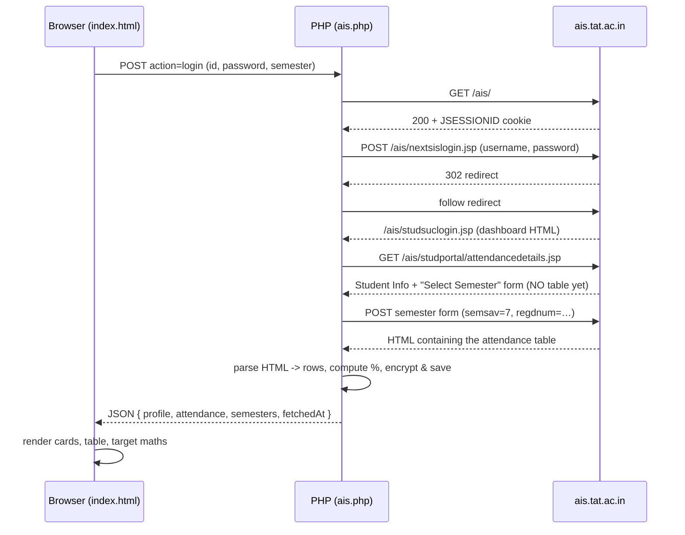

# TAT SANGAM — AIS Integration: How It Works

Complete technical documentation of the attendance integration with
`ais.tat.ac.in` (Trident E-Governance portal).

---

## 1. What this system does, in one paragraph

The college portal (**AIS**) shows your attendance, but only as a plain HTML
table, one semester at a time, after several clicks. This system signs in to AIS
**on your behalf**, reads that page, converts it into clean structured data
(JSON), and displays it in the TAT SANGAM design with extra calculations the
portal does not give you — such as *"how many classes can I still skip?"*.

The important word is **integration**, not "download". AIS has no API, so the
data is obtained by **reading the same HTML pages a student would see** and
extracting the values from them. That technique is called **screen scraping**
(or HTML parsing).

---

## 2. The big question: is the data live, or stored?

**Both — and the distinction matters.** The system uses a
**fetch-on-demand + cache** model.

| Moment | What happens | Live or stored? |
|---|---|---|
| You press **Sign in** | Logs in to AIS, reads the real page | **Live** |
| You press **Refresh** | Logs in again, reads the page again | **Live** |
| You change **Semester** | Logs in again, submits that semester | **Live** |
| You reload the page | Shows the **last saved copy** instantly | **Stored (cached)** |
| You change **Target %** | Recalculates in the browser only | **Neither** — pure maths |

So:

- Data is **never invented and never guessed** — every number originates from a
  real AIS page fetch.
- Between fetches, the last result is kept so reopening the page is instant and
  does not hammer the college server.
- The screen always tells you which you are looking at: **"Synced 8/15/2026,
  11:04 AM"**.

### What is stored, and where

```
_store/<random-token>.bin      <- encrypted file, this folder only
```

That single encrypted file holds:

| Field | Meaning |
|---|---|
| `u` | your AIS user ID |
| `p` | your AIS password (**encrypted**, see §6) |
| `profile` | student details (name, reg. no, branch, section, …) |
| `attendance` | the last fetched subject rows |
| `semesters` | the semester list AIS actually offers |
| `semester` | which semester was last loaded |
| `fetchedAt` | timestamp of that fetch |

**Nothing goes into MySQL.** The `tat_sangam` database used by the main planner
app is untouched by this feature — no new tables, no new columns.

---

## 3. System architecture

This is a **three-tier client–server architecture** with a **connector
(adapter) layer** talking to an external system.

```
 TIER 1 — PRESENTATION (browser)
 ┌──────────────────────────────────────────────┐
 │  index.html                                  │
 │  • sign-in form                              │
 │  • student card / summary / attendance table │
 │  • target-% maths, responsive layout         │
 └───────────────────┬──────────────────────────┘
                     │  HTTP POST (fetch API), JSON
                     ▼
 TIER 2 — APPLICATION (your PHP server)
 ┌──────────────────────────────────────────────┐
 │  ais.php          — API endpoint / router    │
 │  ais_lib.php      — connector + parsers      │
 │      AisConnector ....... session + HTTP     │
 │      ais_parse_* ........ HTML -> data       │
 │      ais_store_* ........ encrypted storage  │
 └───────────────────┬──────────────────────────┘
                     │  HTTPS + cookies (cURL)
                     ▼
 TIER 3 — EXTERNAL SYSTEM (not ours)
 ┌──────────────────────────────────────────────┐
 │  ais.tat.ac.in   (JSP portal behind          │
 │                   Cloudflare)                │
 └──────────────────────────────────────────────┘
```

### Why the middle tier exists

A browser **cannot** call AIS directly. Two hard blockers:

1. **CORS** (Cross-Origin Resource Sharing). A web page may only read responses
   from another website if that site sends an `Access-Control-Allow-Origin`
   header. AIS does not. The browser blocks the request before it is even sent.
2. **Credential safety.** Putting a college password into front-end JavaScript
   exposes it to anything running on the page.

The PHP layer sits in the middle: the browser talks to *your* server, and *your*
server talks to AIS. This pattern is called a **backend-for-frontend** or
**server-side proxy**.

---

## 4. The data pipeline, step by step

This is the exact sequence, verified against the live portal.



### Step 1 — Establish a session

```
GET https://ais.tat.ac.in/ais/
```

The server replies with a **`JSESSIONID`** cookie. This is a *session cookie* —
a random ID that lets the server recognise the same visitor across requests.
Skipping this step and posting the login "cold" can silently lose the session on
JSP portals, so it is always done first.

### Step 2 — Log in

```
POST https://ais.tat.ac.in/ais/nextsislogin.jsp
Content-Type: application/x-www-form-urlencoded
username=<id>&password=<password>
```

Confirmed by inspecting the live login page: **two fields only**, no CSRF token,
no captcha. The server replies **302 Found** (a redirect) to
`/ais/studsuclogin.jsp`, the student dashboard.

**How success is detected:** not by the status code, but by *where we landed*.
If the final URL contains `studsuclogin.jsp`, the login worked. If the response
still contains a login form, the credentials were wrong.

### Step 3 — Open the attendance page

```
GET https://ais.tat.ac.in/ais/studportal/attendancedetails.jsp
```

**This page does not contain attendance data.** It returns the *Student
Information* block plus a **"Select Semester"** dropdown. This was the single
biggest surprise during development — the attendance link does not return
attendance.

### Step 4 — Submit the semester

The page contains a form:

| Field | Type | Purpose |
|---|---|---|
| `regdnum` | hidden | your registration number |
| `semsav` | select | semester 1…7 |

The connector finds this form automatically (it looks for a `<select>` whose
options are plain numbers), copies every existing field ("replaying" the hidden
values), sets the chosen semester, and posts it back. Only then does AIS return
the real attendance table.

### Step 5 — Parse and normalise

The returned HTML is converted into a clean array:

```json
{
  "subject":    "Design and Analysis of Algorithms",
  "code":       "CSPC2006",
  "held":       11,
  "attended":   6,
  "percentage": 54.55
}
```

**Normalisation** means converting messy external data into one consistent
internal shape. Everything downstream uses this shape and never touches AIS
HTML again.

> **Percentages are recalculated, never copied.** AIS prints its own `%` column,
> but it is the field most likely to be formatted oddly. We compute
> `attended ÷ held × 100` ourselves and ignore theirs.

---

## 5. How the HTML parsing actually works

AIS is a portal built around the year 2005. Its HTML uses **nested layout
tables** — tables inside tables inside tables — because that was how pages were
built before CSS layout. There is no `id` or `class` to target. So the parser
uses **heuristics** (rules of thumb) instead of fixed selectors.

### 5.1 Finding the right table — scoring

Every `<table>` on the page is scored by its header wording:

| Header contains | Points |
|---|---|
| subject / course / paper | +3 |
| held / conducted / delivered / total | +3 |
| attended / present | +3 |

The highest scorer wins, and it must reach 9. A table also needs **at least 3
header cells** — page-layout wrappers have one or two giant cells and are
rejected.

### 5.2 The ownership rule (the hard part)

Two opposite traps exist in this markup, and this is where most of the
development time went:

| Approach | Nested wrapper tables | Rows wrapped in `<form>` |
|---|---|---|
| `getElementsByTagName('tr')` | ❌ swallows inner rows | ✅ finds them |
| direct children (`./tr`) | ✅ excludes them | ❌ misses them |

Why the second trap exists: AIS wraps **every attendance row in its own
`<form>`** so a row can be clicked for detail:

```html
<table>
  <tr><th>Slno.</th>…</tr>                      <!-- parent = <table> -->
  <form action="viewstudentattendance.jsp">
    <tr><td>1</td>…</tr>                        <!-- parent = <form>  -->
  </form>
</table>
```

That is invalid HTML, so the browser/parser **reparents** the row under the
`<form>`. Neither simple approach works.

**The rule that does work:** a row belongs to a table when its **nearest
ancestor `<table>` is that table**. This is true through `<form>`, `<tbody>`, or
anything else in between, while still excluding rows of genuinely nested tables.
The same rule is applied to cells via nearest ancestor `<tr>`.

### 5.3 Choosing the right columns

The header is `Slno. | Subject Code | Subject Name | Classes Held | Classes
Attended | Percentage`. Naive matching goes wrong twice:

- `"Subject Code"` and `"Subject Name"` both contain *subject*
- `"Attendance %"` contains *attend*

So each column is matched by **priority order with exclusions**: try the most
specific wording first, and skip any column matching an exclusion pattern
(`/code|%|percent/` for the subject name, `/%|percent/` for attended).

### 5.4 Reading the student details

Student Information arrives as **two label/value pairs per row**:

```
["Registration number", "2301289114", "Session:", "2026-2027"]
```

The parser walks each row **in pairs**, and only inside the block anchored by
the heading *"Student Information"* — otherwise the attendance table's own
6-cell rows would also read as pairs ("Subject Name" → "Classes Held").

### 5.5 When parsing fails

The page never fails silently. If no table is recognised it returns a
**structure report** listing every form and table with its headers and first
row, shown on screen with a **Copy report** button. That report is what makes a
fix possible in one pass instead of guesswork.

---

## 6. Security model

### 6.1 The problem

"Stay signed in until I sign out" **requires keeping the password**. There is no
way around that: AIS has no API tokens, no OAuth, no refresh tokens. The only
credential that works is the password itself.

### 6.2 The solution — envelope encryption

```
        YOUR BROWSER                     YOUR SERVER
   ┌────────────────────┐          ┌──────────────────────┐
   │ cookie "tat_ais"   │          │ _store/<token>.bin   │
   │   token . KEY      │          │  nonce+tag+ciphertext│
   │  (HttpOnly)        │          │  (no key inside)     │
   └────────────────────┘          └──────────────────────┘
              └──────────── both needed ─────────┘
```

| Property | Value |
|---|---|
| Algorithm | **AES-256-GCM** (authenticated encryption) |
| Key | 32 random bytes, generated per sign-in |
| **Key storage** | **browser cookie only — never on the server** |
| File name | `_store/<32-hex-token>.bin` |
| File layout | `nonce (12 bytes) + GCM tag (16 bytes) + ciphertext` |
| Cookie flags | `HttpOnly`, `SameSite=Lax`, 30-day expiry |
| Directory | `.htaccess` → `Require all denied` (returns **403**) |

**Terms in plain words**

- **AES-256-GCM** — a standard cipher that both hides the data *and* detects
  tampering. If one byte of the file is altered, decryption is refused.
- **Nonce** — a random "number used once" so encrypting the same text twice
  never produces the same bytes.
- **GCM tag** — a small checksum proving the data was not modified.
- **HttpOnly** — the cookie cannot be read by JavaScript, so a script injected
  into the page cannot steal the key.
- **Envelope encryption** — data is locked in a box on the server, and the key
  to that box is kept somewhere else (here, your browser).

### 6.3 What this protects against, and what it does not

✅ **Protects against:** someone copying `_store/*.bin` (a stolen backup, a
shared-hosting neighbour, a mis-shared folder). Without the cookie the file is
meaningless. Also protects against file tampering, and against JavaScript
reading the key.

❌ **Does not protect against:** someone with **both** your logged-in browser
*and* the server file. On localhost, that person is you. This is genuinely safer
than plaintext, but it is not a vault.

### 6.4 Other safeguards

- Credentials are **only saved after AIS accepts them** — a typo is never stored.
- If your AIS password later changes, the stale copy is **deleted automatically**
  rather than retrying forever.
- The store token is validated against `^[a-f0-9]{32}$`, blocking path-traversal
  attempts like `../../etc/passwd`.
- `CURLOPT_SSL_VERIFYPEER` stays **on**. Most scraping tutorials tell you to
  disable it; doing so would let anyone on the network intercept the password.
- Sign-out deletes the file **and** expires the cookie.

---

## 7. The API (`ais.php`)

All requests are `POST`. All responses are JSON. `Cache-Control: no-store` is
always set, because responses are built from credentials.

| Action | Sends | Does |
|---|---|---|
| `login` | `ais_user`, `ais_pass`, `semester?` | Signs in, fetches, saves the encrypted session |
| `fetch` | `semester?` | Re-reads AIS using the stored sign-in |
| `status` | – | Reports whether signed in, returns cached data |
| `logout` | – | Deletes the store file and expires the cookie |

**Success response**

```json
{
  "success": true,
  "message": "Fetched 7 subjects.",
  "loggedIn": true,
  "aisUser": "230310611420",
  "profile": { "Name": "…", "Registration number": "…", "Semester": "7" },
  "attendance": [ { "subject": "…", "code": "…", "held": 11,
                    "attended": 6, "percentage": 54.55 } ],
  "semesters": ["1","2","3","4","5","6","7"],
  "usedSemester": "7",
  "fetchedAt": "2026-08-15T11:04:00+02:00"
}
```

### Error classes are kept distinct

This matters: reporting a Cloudflare block as "wrong password" would send you
chasing the wrong problem.

| Situation | Message |
|---|---|
| Wrong credentials | *AIS rejected those credentials…* |
| Session expired mid-read | *The AIS session expired while reading…* |
| Bot protection | *Cloudflare blocked this request (HTTP 403)…* |
| Network failure | *Could not reach ais.tat.ac.in: …* |
| Layout unrecognised | *…the attendance table was not recognised* + structure report |

---

## 8. Front-end behaviour

### On page load

```
POST action=status
   ├─ not signed in  -> show the sign-in form
   ├─ signed in + cache -> render instantly, no AIS call
   └─ signed in, no cache -> POST action=fetch
```

### The calculations (done in the browser)

With target `t` (e.g. 0.75):

**If you are above target — how many you can still skip:**

```
attended / (held + x) >= t     =>     x = floor(attended / t - held)
```

**If you are below target — how many you must attend in a row:**

```
(attended + x) / (held + x) >= t   =>   x = ceil((t*held - attended) / (1 - t))
```

Worked example — *Design and Analysis of Algorithms*, 6 of 11 at 75%:

```
x = ceil((0.75 x 11 - 6) / 0.25) = ceil(2.25 / 0.25) = ceil(9) = 9
check: (6 + 9) / (11 + 9) = 15/20 = 75%   ✓
```

Changing **Target %** re-runs this instantly with **no network request**,
because the raw counts are already in the browser.

---

## 9. The alternative mode: `tat-attendance.user.js`

There is a second, **password-free** way to get the same data.

| | Server connector (`index.html`) | In-browser panel (userscript) |
|---|---|---|
| Where it runs | your PHP server | inside ais.tat.ac.in, in your browser |
| Password needed | yes (stored encrypted) | **none** |
| Uses | a fresh AIS login | the session you already have |
| Works for | any device pointed at your server | only your own browser |
| Data leaves browser | to your server | **never** |

The userscript works because it runs **on the portal's own origin**, so CORS
does not apply. Paste it into DevTools (F12 → Console) while logged in, or
install it with Tampermonkey. It is the safer option when you only need your own
data on your own machine.

---

## 10. File map

| File | Role |
|---|---|
| `index.html` | Presentation tier — UI, rendering, target maths |
| `ais.php` | Application tier — API router, orchestration |
| `ais_lib.php` | Connector + parsers + encrypted store (pure library) |
| `tat-attendance.user.js` | Password-free in-browser alternative |
| `style.css` | Copy of the TAT SANGAM design system |
| `_store/` | Encrypted sessions (HTTP-blocked) |
| `_test-*.html` | Offline fixtures reproducing real page quirks |
| `ais.tat.ac.in.har` | Original network capture — **contains a plaintext password** |

`ais_lib.php` is deliberately a **pure library**: it defines things but runs
nothing, so it can be included by a test script without triggering a real
request. That is what made offline testing possible.

---

## 11. Operational notes and limitations

1. **Cloudflare.** The portal sits behind Cloudflare with passive bot detection.
   Server-side requests work today (verified: HTTP 200 + `JSESSIONID` issued).
   If it ever starts challenging, that is a **stop sign** — use the userscript
   or request approved access. Do not attempt to defeat a challenge.
2. **HTTPS is mandatory if deployed.** On localhost this is fine. On public
   hosting over plain HTTP, the AIS password crosses the network in clear text.
3. **Permission.** For your own account this is ordinary personal automation.
   The moment other students enter their credentials, it becomes a
   credential-handling service for a system you do not own — get written
   approval from TAT IT first.
4. **The parser is heuristic.** If AIS redesigns the page, parsing may fail —
   but it will fail *loudly*, with a structure report, not silently.
5. **`style.css` is a duplicate** of `../Project/style.css`. Edits to one do not
   reach the other. It also owns some `id` selectors — `#logoutBtn` in that file
   hides its label below 576px, which is why this page's button is called
   `#aisSignOutBtn`.
6. **Unrelated but important:** `Project/api/auth.php` still stores TAT SANGAM
   passwords in **plain text**. That is separate from this feature (no AIS
   credential goes near that database), but it should be fixed with
   `password_hash()` / `password_verify()`.

---

## 12. How this was verified

Because the real page needed credentials that could not be used during
development, correctness was established with **offline fixtures** reproducing
the exact quirks of the live page.

| Area | Checks |
|---|---|
| Parsing | data table chosen over layout wrappers; `<form>`-wrapped rows read; "Total" row skipped; column priority (`Subject Name` not `Subject Code`); windows-1252 accents; zero-classes-held |
| Session flow | semester form detected (`semsav`, `regdnum`); hidden fields replayed; relative/absolute/empty form actions resolved |
| Crypto | password absent from the file; wrong key rejected; tampered blob rejected; path traversal rejected; sign-out removes file + cookie; `_store/` returns 403 |
| API | `405` on GET; missing credentials; unknown action; full status→login→fetch→logout cycle |
| UI | responsive at 320 / 480 / 700 / 1280 px with no horizontal overflow; table stacks into cards below 720px; target maths at 75% and 85% |

---

## 13. Glossary

| Term | Plain meaning |
|---|---|
| **Screen scraping** | Reading a website's HTML to extract data, because no API exists |
| **Parsing** | Turning text (HTML) into structured data a program can use |
| **Normalisation** | Converting messy external data into one consistent internal shape |
| **CORS** | Browser rule that stops a page reading another site's responses |
| **Session cookie (`JSESSIONID`)** | Random ID letting a server recognise you across requests |
| **cURL** | The PHP library used to make HTTP requests from the server |
| **Endpoint** | A single URL that accepts requests and returns data (`ais.php`) |
| **Payload** | The data carried inside a request or response |
| **Cache** | A saved copy reused to avoid repeating slow work |
| **Heuristic** | A rule of thumb used when there is no exact identifier |
| **Envelope encryption** | Locking data on the server, keeping the key elsewhere |
| **Nonce** | A random value used once so identical data encrypts differently |
| **HttpOnly** | A cookie flag making the cookie invisible to JavaScript |
| **Backend-for-frontend** | A server that sits between the browser and an external system |
